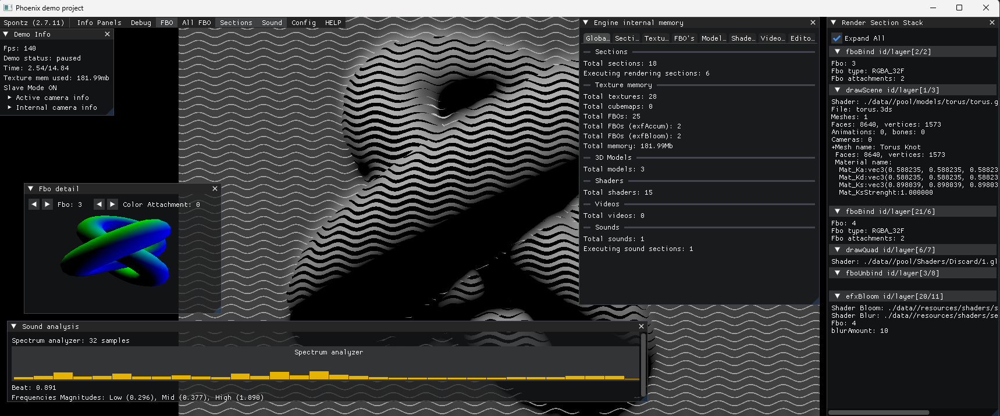
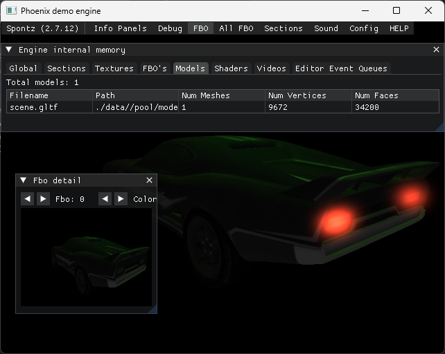
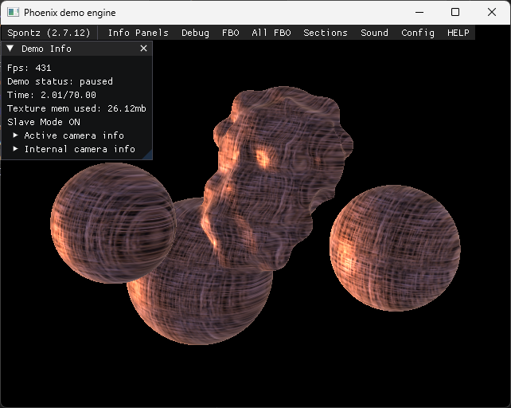
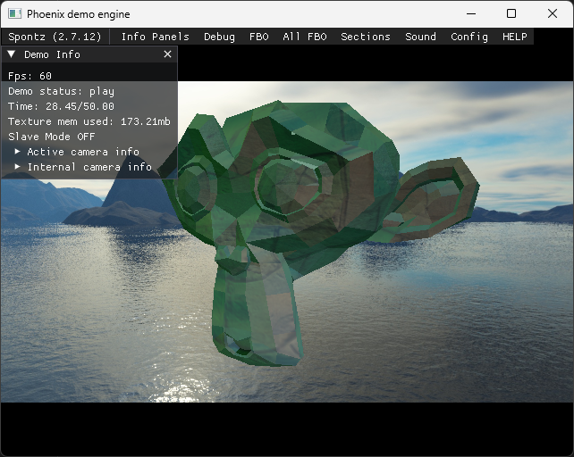
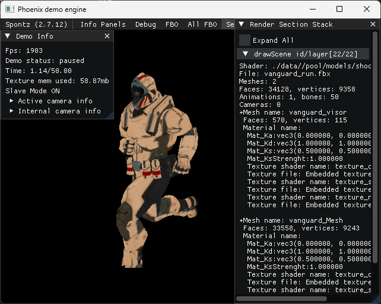

# Phoenix :: Spontz demo Engine
Welcome to the infamous Phoenix :: Spontz demoengine. Be aware that each line of this code has been written with tons of suffering and [untamed indomitus nighly] pain. Please take into consideration that this could (would) extent to you if you decide to take a look.

This demo engine is an old piece of software that has undergone several heavy updates since its original C version. We have released about twenty demos with it. Main efforts come from:

* Kolian: The main developer of the original 'Inferno/Dragon' Spontz demoengine.
* Spöntz members: isaac2, Khrome, merlucin, madgoblin, shotgan, xphere.

This engine would not exist without inspiration obtained from the following sources. Thanks!

* Yan Chernikov / aka 'The Cherno': https://github.com/TheCherno
* Etay Meiri / OGL Dev site: https://ogldev.org/
* jmorton06 / Lumos engine: https://github.com/jmorton06/Lumos

Phoenix currently uses the following libraries and frameworks:

* OpenGL: GPU rendering backend used by Engine and Launcher. https://www.opengl.org/
* GLFW: window creation, OpenGL context, and input handling. https://github.com/glfw/glfw
* GLAD: OpenGL function loader used to access runtime driver APIs. https://glad.dav1d.de
* GLM: math types and operations (vectors, matrices, transforms, quaternions). https://github.com/g-truc/glm
* Dear ImGui: in-engine/editor debug and tooling UI. https://github.com/ocornut/imgui
* Assimp: import of 3D assets and scene data. https://github.com/assimp/assimp
* stb (stb_image): image loading for textures and cubemaps. https://github.com/nothings/stb
* FFmpeg: video decoding and encoding pipeline (playback + streaming support). https://github.com/FFmpeg/FFmpeg
* miniaudio: audio playback/runtime audio backend. https://miniaud.io
* kissfft: FFT analysis utilities used by audio/reactive workflows. https://github.com/mborgerding/kissfft
* exprtk: runtime math expression parsing/evaluation used by section scripting. https://github.com/ArashPartow/exprtk
* uWebSockets: HTTP/WebSocket server for the editor API bridge (Cacablu <-> Phoenix). https://github.com/uNetworking/uWebSockets
* LibDataChannel: WebRTC transport stack used by framebuffer streaming. https://github.com/paullouisageneau/libdatachannel
* dyad.c: lightweight legacy networking module still present in the codebase. https://github.com/rxi/dyad

## Instructions (Windows)

Use one of these bootstrap scripts depending on your situation:

* `00_bootstrap_install.bat` (first-time setup / clean setup)
  * Deletes the local `vcpkg` folder.
  * Clones `microsoft/vcpkg` again.
  * Bootstraps vcpkg and installs all required third-party libraries.
  * Recreates the `phoenix_vs2026` CMake build folder and generates the Visual Studio 2026 solution.

* `00_bootstrap_update.bat` (existing setup / dependency refresh)
  * Reuses the existing `vcpkg` folder.
  * Runs `vcpkg update` and reinstalls required third-party libraries.
  * Recreates the `phoenix_vs2026` CMake build folder and regenerates the Visual Studio 2026 solution.

After running either script, open the generated solution in `phoenix_vs2026` and build with Visual Studio.

## Debug launch with Cacablu

When launching the Debug build outside Visual Studio, always use the same working directory configured by CMake and pass the matching data folder explicitly:

```powershell
Start-Process `
  -FilePath ".\phoenix_vs2026\Launcher\Debug\Phoenix.exe" `
  -WorkingDirectory ".\Launcher" `
  -ArgumentList "-datafolder `".\Launcher\data`""
```

`Launcher\data\config\control.spo` must contain `slave 1` for the editor API to listen on `127.0.0.1:29100`.

# Screenshots

<p align="center">
  
  
  
  
  
</p>


<p align="center">
  
</p>
